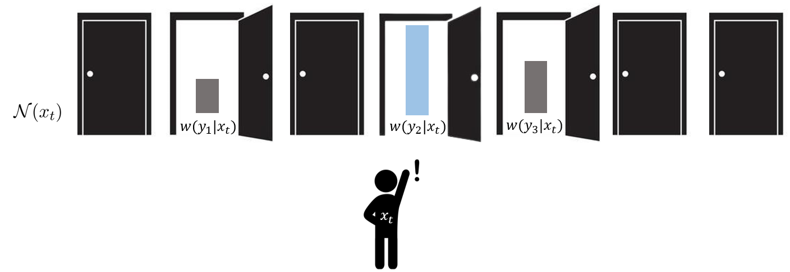
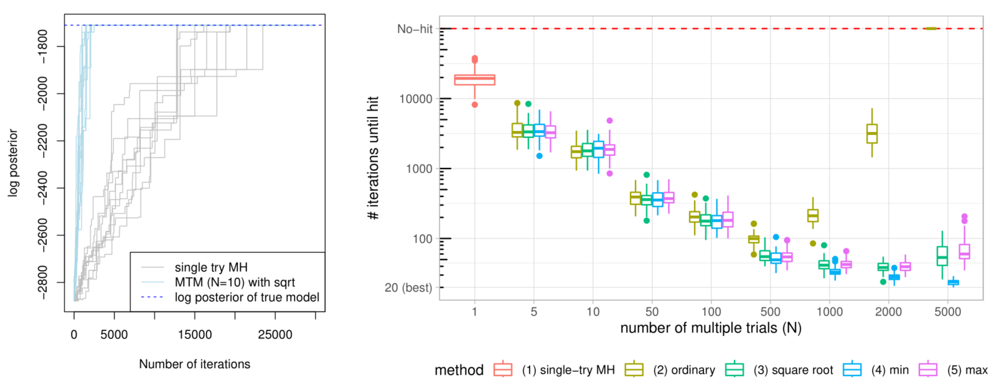

<!-- README.md is generated from README.Rmd. Please edit that file -->

```{r, include = FALSE}
knitr::opts_chunk$set(
  collapse = TRUE,
  comment = "#>",
  fig.path = "man/figures/README-",
  out.width = "100%"
)
```
<!-- badges: start -->
<!-- badges: end -->

This repository contains implementations of the paper [Rapidly Mixing Multiple-try Metropolis Algorithms for Model Selection Problems](https://arxiv.org/abs/2207.00689) by Hyunwoong Chang, Changwoo Lee, Zhao Tang Luo, Huiyan Sang, and Quan Zhou, which is accepted at [NeurIPS 2022](https://nips.cc/Conferences/2022). 

We study multiple-try Metropolis (MTM) algorithm [(Liu, Liang, and Wong, 2000)](#references), which is an extension of the Metropolis-Hastings (MH) algorithm by selecting the proposed state among multiple trials according to some weight function $w(y|x)$. Below cartoon depicts how MTM algorithms choose the proposed state $y=y_2$ among $N=3$ trials ($y_1,y_2,y_3$) from the current state $x_t$.





We prove that MTM algorithm can achieve a mixing time bound smaller than that of Metropolis-Hastings (MH) algorithm *by a factor of the number of trials $N$* under a general setting applicable to high-dimensional model selection problems, such as Bayesian variable selection, stochastic block models, and spatial clustering models.





## Example 1: Bayesian variable selection

This is a basic example which shows you how to solve a common problem:

```{r example1}
## basic example code
```


## Example 2: Stochastic block models

This is a basic example which shows you how to solve a common problem:

```{r example2}
## basic example code
```


### References

Liu, J. S., Liang, F., & Wong, W. H. (2000). The multiple-try method and local optimization in Metropolis sampling. Journal of the American Statistical Association, 95(449), 121-134.

Chang, H., Lee, C. J., Luo, Z. T., Sang, H., & Zhou, Q. (2022). Rapidly Mixing Multiple-try Metropolis Algorithms for Model Selection Problems. Advances in Neural Information Processing Systems 35 (NeurIPS), just-accepted.
