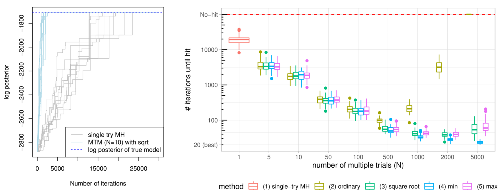
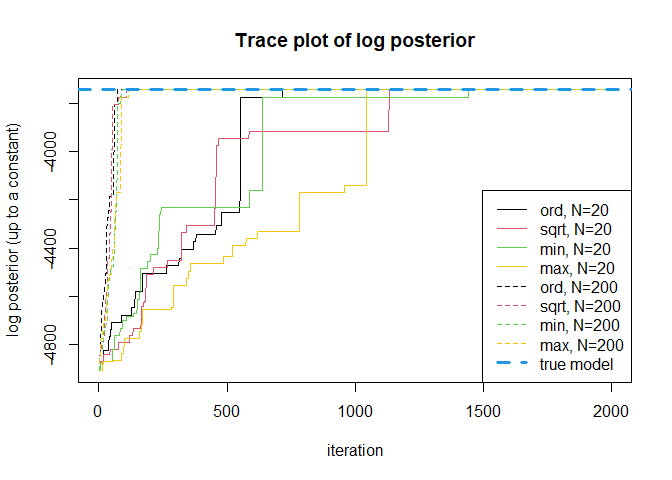

Rapidly Mixing Multiple-try Metropolis Algorithms for Model Selection
Problems
================

<!-- README.md is generated from README.Rmd. Please edit that file -->
<!-- badges: start -->
<!-- badges: end -->

This repository contains implementations of the paper

[Rapidly Mixing Multiple-try Metropolis Algorithms for Model Selection
Problems](https://arxiv.org/abs/2207.00689)  
Hyunwoong Chang\*, Changwoo J. Lee\*, Zhao Tang Luo, Huiyan Sang, and
Quan Zhou,  
accepted at [NeurIPS 2022](https://nips.cc/Conferences/2022),
*oral-designated*.

We study multiple-try Metropolis (MTM) algorithm [(Liu, Liang, and Wong,
2000)](#references), which is an extension of the Metropolis-Hastings
(MH) algorithm by selecting the proposed state among multiple trials
according to some weight function $w(y|x)$. Below cartoon depicts how
MTM algorithms choose the proposed state $y=y_2$ among $N=3$ trials
$y_1,y_2,y_3$ from the current state $x_t$.


We prove that MTM algorithm with *locally balanced weight functions* can
achieve a mixing time bound smaller than that of Metropolis-Hastings
(MH) algorithm **by a factor of the number of trials** $N$, under a
general setting applicable to high-dimensional model selection problems
such as Bayesian variable selection, stochastic block models, and
spatial clustering models.

<!--

-->

## Example: Bayesian variable selection (BVS)

In this demo, we show an illustrative example with Bayesian variable
selection (BVS) problems described in Section 4.1. of the paper.
Consider a high-dimensional linear model with response
$y\in\mathbb{R}^p$ and design matrix $X\in\mathbb{R}^{n\times p}$, where
the number of predictors is much larger than the sample size $n$.

$$
y  = X\beta + \epsilon, \quad \epsilon\sim N(0, \phi^{-1}I_n)
$$

Under the sparse statistical model [(Hastie, Tibshirani, and Wainwright,
2015)](#references) where $\beta\in\mathbb{R}^p$ has only few nonzero
components, BVS seeks to find the best subset of predictors denoted as a
binary vector $`\gamma\in\{0,1\}^p`$ where $\gamma_j=1$ indicates j-th
predictor is included in the model. The main interest is the posterior
distribution $\pi(\gamma|y)$, and we sample from $\pi(\gamma|y)$ using
Markov chain Monte Carlo (MCMC) methods, such as multiple-try Metropolis
(MTM) algorithm.

In this brief demo, we investigate the behavior of MTM, focusing on
implications of the main theorem in our paper:

-   As $N$ increases, mixing time of MTM algorithm becomes smaller by a
    factor of $N$.
-   Using the nondecreasing locally balanced weight function is
    necessary to establish such result.

<!--
When symmetric proposal is used, the locally balanced weight function is
\[
w(y\,|\,x) = h\left(\frac{\pi(y)}{\pi(x)}\right), \quad \text{ with } h(u) = u\cdot h(1/u) \text{for all }u>0.
\]
where examples of balancing function $h$ includes $h(u)=\sqrt{u}$, $h(u)=\min(1,u)$, and $h(u)=\max(1,u)$. 
-->

First we generate simulated data according to Section 4.1.

``` r
## Load libraries, if not installed, install with: install.packages("package name")
library(mgcv) # for Cholesky update
#> Loading required package: nlme
#> This is mgcv 1.8-40. For overview type 'help("mgcv-package")'.
library(matrixStats) # for logsumexp

## data generation
n = 1000; p = 5000; # dimension of design matrix
snr = 4 # signal-to-noise ratio

s = 10; b0 = c(2,-3,2,2,-3,3,-2,3,-2,3); # true model size = 10
beta = c(b0, rep(0, p - s)) * sqrt( log(p)/n ) * snr # true coefficients

set.seed(1)
X = scale(matrix(rnorm(n*p), nrow=n), center = T)
y = X %*% beta + rnorm(n)

# preprocess, take some time
preprocessed = list(
  XtX = crossprod(X),
  Xty = crossprod(X, y),
  yty = crossprod(y)
)
```

Now we set the initial state of the Markov chain $\gamma_0$, and
evaluate the log-posterior value at true model
$\gamma=(1,1,1,1,1,1,1,1,1,1,0,\dots,0)$.

``` r
# initialize gamma (binary vector) s.t. 20 steps needed to reach the true model 
gammainit = rep(0,p) 
gammainit[sample.int(p-10, size = 10) + 10] = 1

# under hyperparameter settings kappa = 2, g = p^3
kappa = 2; g = p^3; 
strue = sum(beta!=0)
SSRtrue = preprocessed$yty - g/(g+1)*t(preprocessed$Xty[1:10])%*%solve(preprocessed$XtX[1:10,1:10],preprocessed$Xty[1:10])
logposttrue = -kappa*strue*log(p) - strue/2*log(1+g) - n/2*log(SSRtrue) # see eq. 13 of the paper
```

We run the MTM algorithms with $N=20,200$ and four different choices of
weight functions:

-   $w_{\mathrm{ord}}(y|x) = \pi(y)$ (ordinary, not locally balanced)
-   $w_{\mathrm{sqrt}}(y|x) = \sqrt{\pi(y)/\pi(x)}$ (sqrt, locally
    balanced)
-   $w_{\mathrm{min}}(y|x) = \min(\pi(y)/\pi(x),1)$ (min, locally
    balanced)
-   $w_{\mathrm{max}}(y|x) = \max(\pi(y)/\pi(x),1)$ (max, locally
    balanced)

``` r
source("R/bvs_mtm.R")
# ntry = 20  
fit_ord_20 = bvs_mtm(y, X, ntry =  20, balancingft = NULL, burn = 0, nmc = 2000,
                       preprocessed = preprocessed, gammainit = gammainit)
#> [1] "balancingft is not provided, using ordinary weight function w(y|x) = p(y)"
#> Run MCMC, initial model size: 10 
#> iteration 1000 model size: 10 
#> iteration 2000 model size: 10 
#> Elapsed time for 2000 MCMC iteration:  0.893409 secs

fit_sqrt_20 = bvs_mtm(y, X, ntry =  20, balancingft = "sqrt", burn = 0, nmc = 2000,
                      preprocessed = preprocessed, gammainit = gammainit)
#> Run MCMC, initial model size: 10 
#> iteration 1000 model size: 9 
#> iteration 2000 model size: 10 
#> Elapsed time for 2000 MCMC iteration:  0.634944 secs

fit_min_20 = bvs_mtm(y, X, ntry =  20, balancingft = "min", burn = 0, nmc = 2000,
                     preprocessed = preprocessed, gammainit = gammainit)
#> Run MCMC, initial model size: 10 
#> iteration 1000 model size: 11 
#> iteration 2000 model size: 10 
#> Elapsed time for 2000 MCMC iteration:  0.7078671 secs

fit_max_20 = bvs_mtm(y, X, ntry =  20, balancingft = "max", burn = 0, nmc = 2000,
                     preprocessed = preprocessed, gammainit = gammainit)
#> Run MCMC, initial model size: 10 
#> iteration 1000 model size: 9 
#> iteration 2000 model size: 10 
#> Elapsed time for 2000 MCMC iteration:  0.679898 secs

# ntry = 200
fit_ord_200 = bvs_mtm(y, X, ntry =  200, balancingft = NULL, burn = 0, nmc = 2000,
                     preprocessed = preprocessed, gammainit = gammainit)
#> [1] "balancingft is not provided, using ordinary weight function w(y|x) = p(y)"
#> Run MCMC, initial model size: 10 
#> iteration 1000 model size: 10 
#> iteration 2000 model size: 10 
#> Elapsed time for 2000 MCMC iteration:  1.349529 secs

fit_sqrt_200 = bvs_mtm(y, X, ntry =  200, balancingft = "sqrt", burn = 0, nmc = 2000,
                      preprocessed = preprocessed, gammainit = gammainit)
#> Run MCMC, initial model size: 10 
#> iteration 1000 model size: 10 
#> iteration 2000 model size: 10 
#> Elapsed time for 2000 MCMC iteration:  1.25786 secs

fit_min_200 = bvs_mtm(y, X, ntry =  200, balancingft = "min", burn = 0, nmc = 2000,
                     preprocessed = preprocessed, gammainit = gammainit)
#> Run MCMC, initial model size: 10 
#> iteration 1000 model size: 10 
#> iteration 2000 model size: 10 
#> Elapsed time for 2000 MCMC iteration:  1.326942 secs

fit_max_200 = bvs_mtm(y, X, ntry =  200, balancingft = "max", burn = 0, nmc = 2000,
                     preprocessed = preprocessed, gammainit = gammainit)
#> Run MCMC, initial model size: 10 
#> iteration 1000 model size: 10 
#> iteration 2000 model size: 10 
#> Elapsed time for 2000 MCMC iteration:  1.366856 secs

# plot 
plot(fit_ord_20$logpostout, col = 1, type="l", main = "Trace plot of log posterior (up to constant)")
lines(fit_sqrt_20$logpostout, col = 2)
lines(fit_min_20$logpostout, col = 3)
lines(fit_max_20$logpostout, col = 7)
lines(fit_ord_200$logpostout, col = 1, lty = 2)
lines(fit_sqrt_200$logpostout, col = 2, lty = 2)
lines(fit_min_200$logpostout, col = 3, lty = 2)
lines(fit_max_200$logpostout, col = 7, lty = 2)
abline(h = logposttrue, col = 4, lty = 2, lwd =3)
legend("bottomright",lty = c(1,1,1,1,2,2,2,2,2),
       col = c(1,2,3,7,1,2,3,7,4),lwd = c(1,1,1,1,1,1,1,1,3),
       legend = c("ord, N=20","sqrt, N=20","min, N=20","max, N=20",
                  "ord, N=200","sqrt, N=200","min, N=200","max, N=200",
                  "true model"))
```



We can check that MTM with $N=200$ converges to the true model roughly
10 times faster than MTM with $N=20$. Note that the elapsed wall-clock
time for MCMC iteration is only about 2 times increased (not 10 times),
thanks to the vectorized computation for $N$ weight functions.

When $N$ is relatively small, $w_{\mathrm{ord}}$ shows no difference
from locally balanced weight functions. Let’s see when $N$ becomes
large, such as $N=2000$:

``` r
### ntry = 2000
fit_ord_2000 = bvs_mtm(y, X, ntry =  2000, balancingft = NULL, burn = 0, nmc = 1000,
                     preprocessed = preprocessed, gammainit = gammainit)
#> [1] "balancingft is not provided, using ordinary weight function w(y|x) = p(y)"
#> Run MCMC, initial model size: 10 
#> iteration 1000 model size: 10 
#> Elapsed time for 1000 MCMC iteration:  3.904636 secs

fit_sqrt_2000 = bvs_mtm(y, X, ntry =  2000, balancingft = "sqrt", burn = 0, nmc = 1000,
                      preprocessed = preprocessed, gammainit = gammainit)
#> Run MCMC, initial model size: 10 
#> iteration 1000 model size: 10 
#> Elapsed time for 1000 MCMC iteration:  3.254738 secs

fit_min_2000 = bvs_mtm(y, X, ntry =  2000, balancingft = "min", burn = 0, nmc = 1000,
                        preprocessed = preprocessed, gammainit = gammainit)
#> Run MCMC, initial model size: 10 
#> iteration 1000 model size: 10 
#> Elapsed time for 1000 MCMC iteration:  3.097136 secs

fit_max_2000 = bvs_mtm(y, X, ntry =  2000, balancingft = "max", burn = 0, nmc = 1000,
                        preprocessed = preprocessed, gammainit = gammainit)
#> Run MCMC, initial model size: 10 
#> iteration 1000 model size: 10 
#> Elapsed time for 1000 MCMC iteration:  2.882234 secs

plot(fit_sqrt_2000$logpostout, type = "l", col = 2, main = "Trace plot of log posterior (up to constant)")
lines(fit_ord_2000$logpostout, col = 1)
lines(fit_min_2000$logpostout, col = 3)
lines(fit_max_2000$logpostout, col = 7)
abline(h = logposttrue, col = 4, lty = 2, lwd =3)
legend("right", lty = c(1,1,1,1,2), col = c(1,2,3,7,4),lwd = c(1,1,1,1,3),
       legend = c("ord, N=2000","sqrt, N=2000","min, N=2000","max, N=2000",
                  "true model"))
```


We can clearly see that MTM with $w_{\mathrm{ord}}$ stuck at local mode
whereas others does not, which shows necessity of using locally balanced
weight functions to achieve a mixing time bound improvement by a factor
of $N$. We note that even under the locally balanced weight functions,
such $N$ times improvement is subject to the rate condition on $N$
described in our main theorem.

### References

Chang, H., Lee, C. J., Luo, Z. T., Sang, H., & Zhou, Q. (2022). Rapidly
Mixing Multiple-try Metropolis Algorithms for Model Selection Problems.
Advances in Neural Information Processing Systems 35 (NeurIPS),
just-accepted.

Hastie, T., Tibshirani, R., & Wainwright, M. (2015). Statistical
learning with sparsity. Monographs on statistics and applied
probability, 143, 143.

Liu, J. S., Liang, F., & Wong, W. H. (2000). The multiple-try method and
local optimization in Metropolis sampling. Journal of the American
Statistical Association, 95(449), 121-134.
